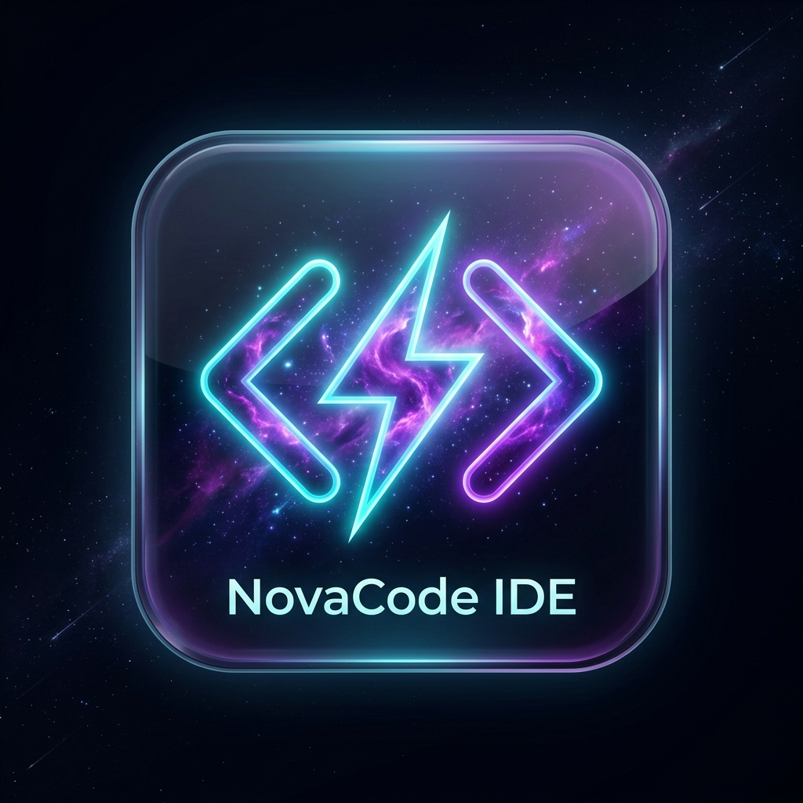

# NovaCode IDE 🚀

> **Бета-версия 1.0.0** — Автономная среда разработки с встроенным ИИ-ассистентом

<p align="center">
  
</p>

**NovaCode IDE** — это современная, кроссплатформенная среда разработки с открытым исходным кодом, построенная на базе **Electron**, **React**, **TypeScript** и **Monaco Editor** (тот же движок, что в VS Code).

IDE предоставляет полноценный рабочий стол разработчика с интегрированным ИИ-ассистентом, живым предпросмотром веб-страниц, терминалом, Git-панелью и визуальным просмотром баз данных — всё в одном окне.

---

## ✨ Основные возможности

### 🤖 Встроенный ИИ-Ассистент (Nova AI)
- **Универсальная совместимость** — поддержка двух протоколов API:
  - **Формат OpenAI** (`/v1/chat/completions`) — OpenAI, OpenRouter, DeepSeek, Google Gemini, Ollama, LM Studio, vLLM и любые совместимые сервисы
  - **Формат Anthropic** (`/v1/messages`) — Claude 3.5 Sonnet, Haiku, Opus
- **Свободный выбор модели** — введите любое название модели вручную (без жёстких списков)
- **Потоковый вывод (streaming)** — ответы приходят в режиме реального времени
- **Контекст текущего файла** — ИИ автоматически получает содержимое открытого файла для анализа

### 📝 Редактор кода
- **Monaco Editor** — полноценный движок VS Code с подсветкой синтаксиса для 90+ языков
- **Мульти-табовый интерфейс** — одновременная работа с несколькими файлами
- **Автодополнение и IntelliSense** — подсказки по коду, сниппеты, навигация по символам
- **Emmet** — мгновенное развёртывание HTML/CSS аббревиатур
- **Настраиваемые темы** — Nova Dark (Космос), VS Code Dark, Nova Light, Light Blue

### 🌐 Живой предпросмотр (Live Preview)
- **Мгновенный рендеринг** HTML/CSS/JS прямо внутри IDE
- **Режимы отображения** — Desktop, Tablet, Mobile
- **Синхронизация с редактором** — изменения отражаются в реальном времени

### 💻 Интегрированный терминал
- **Полноценная консоль** с поддержкой PowerShell / CMD / Bash
- **Буфер обмена** — копирование и вставка текста в терминал
- **Выполнение команд** — запуск скриптов, сборка проектов, управление пакетами

### 📂 Файловый менеджер
- **Дерево проекта** — открытие любой папки как проекта
- **Создание файлов и папок** — Smart File Modal с предустановками (React, Vue, Node.js, Python, Express и др.)
- **Drag & Drop** — перетаскивание файлов

### 🔀 Git-панель
- **Визуальный контроль версий** — просмотр изменений, коммиты, ветки
- **Интеграция с GitHub** — push/pull прямо из IDE

### 🗄️ SQL Database Viewer
- **Визуальный просмотрщик баз данных** — таблицы, запросы, результаты
- **Поддержка SQLite** — работа с локальными базами данных

### 🖥️ Интеграция с Windows
- **Контекстное меню проводника** — «Открывать в NovaCode IDE» (правый клик в любой папке)
- **Нативное сохранение настроек** — конфигурация сохраняется в `%APPDATA%/novacode-ide/`
- **Установщик NSIS** — полноценный инсталлятор с ярлыками
- **Портативная версия** — работает без установки

---

## 🛠️ Быстрый старт

### Установка готового приложения
Скачайте из папки `NovacodeIDE - 1.0.0/`:
- 📦 **`NovaCode-IDE-Setup-1.0.0-beta.exe`** — установщик
- 🚀 **`NovaCode-IDE-Portable-1.0.0-beta.exe`** — портативная версия

### Сборка из исходного кода

```bash
# Клонировать репозиторий
git clone https://github.com/Netrender/novacode.git
cd novacode

# Установить зависимости
npm install

# Запуск в режиме разработки (браузер)
npm run dev

# Запуск в Electron
npm run electron:dev

# Сборка инсталлятора и портативной версии
npm run electron:build
```

---

## 🔧 Настройка ИИ-ассистента

1. Откройте **Настройки** (⚙️ в панели активности)
2. Выберите **формат протокола** (OpenAI или Anthropic)
3. Укажите **Base URL** вашего провайдера
4. Введите **API Key**
5. Укажите **название модели** (например: `gpt-4o`, `claude-3-5-sonnet-20241022`, `deepseek-chat`)

### Примеры настроек

| Провайдер | Формат | Base URL | Модель |
|-----------|--------|----------|--------|
| OpenAI | OpenAI | `https://api.openai.com/v1` | `gpt-4o` |
| Anthropic | Anthropic | `https://api.anthropic.com` | `claude-3-5-sonnet-20241022` |
| OpenRouter | OpenAI | `https://openrouter.ai/api/v1` | `anthropic/claude-3.5-sonnet` |
| DeepSeek | OpenAI | `https://api.deepseek.com/v1` | `deepseek-chat` |
| Ollama (локально) | OpenAI | `http://localhost:11434/v1` | `llama3` |
| LM Studio | OpenAI | `http://localhost:1234/v1` | `local-model` |

---

## 🏗️ Технологический стек

| Компонент | Технология |
|-----------|------------|
| UI фреймворк | React 19 + TypeScript |
| Редактор кода | Monaco Editor (VS Code engine) |
| Десктоп оболочка | Electron 43 |
| Сборщик | Vite 8 |
| Иконки | Lucide React |
| Установщик | electron-builder + NSIS |

---

## 📋 Статус бета-версии

> ⚠️ **Это бета-версия.** Приложение находится в активной разработке. Возможны баги и незавершённые функции.

### Что работает ✅
- Редактор кода с подсветкой синтаксиса
- ИИ-ассистент (OpenAI / Anthropic протоколы)
- Живой предпросмотр HTML/CSS/JS
- Файловый менеджер с деревом проекта
- Терминал с буфером обмена
- Git-панель (базовые операции)
- Настройки с нативным сохранением
- Установщик Windows + портативная версия

### В разработке 🔨
- Расширенная поддержка Git (diff, merge, stash)
- Плагины и расширения
- Поддержка macOS и Linux
- Автообновление приложения

---

## 📄 Лицензия

MIT © [Netrender](https://github.com/Netrender)
